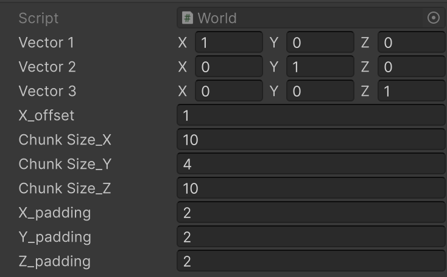
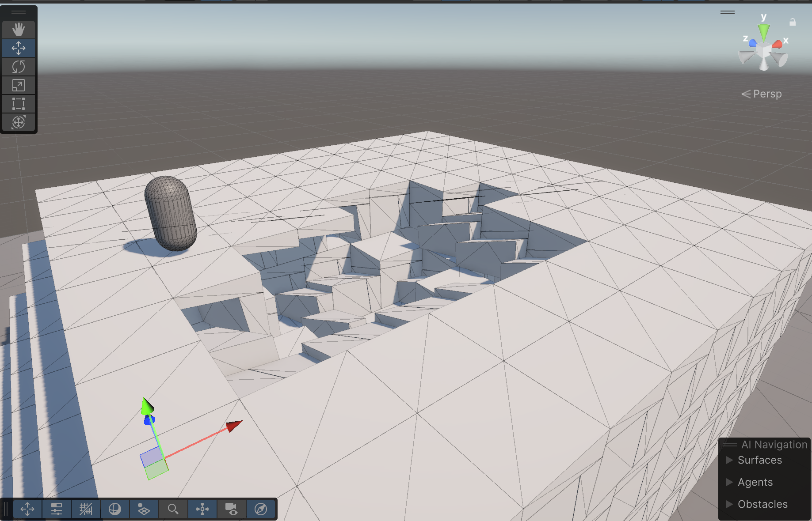
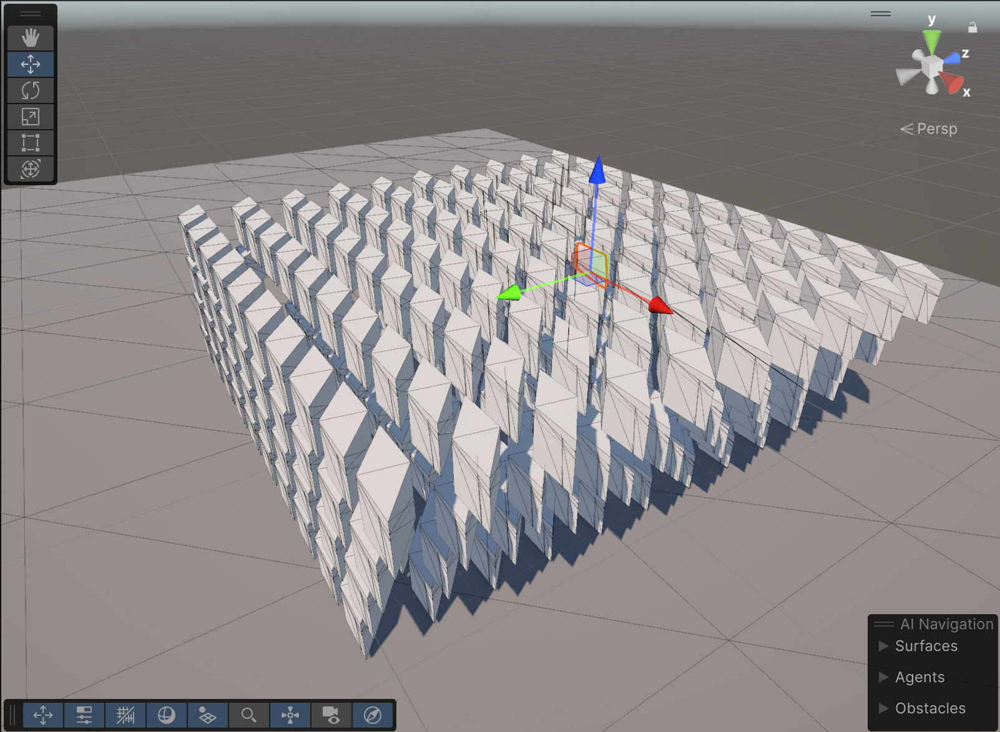
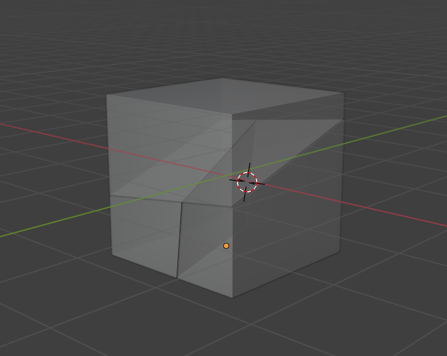
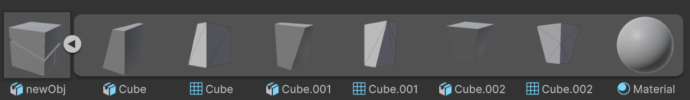
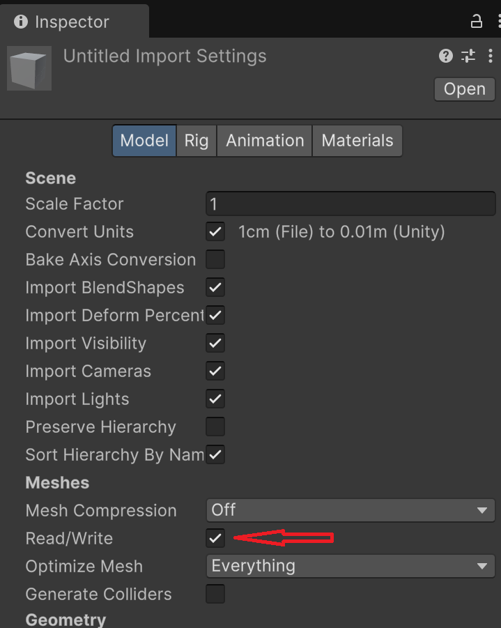
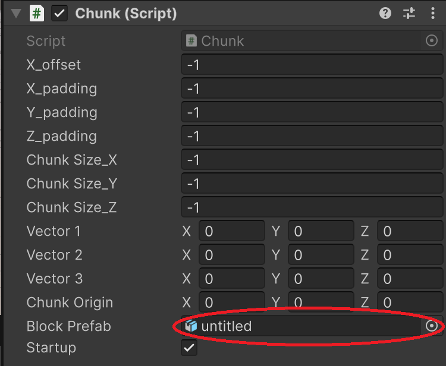

# Voxel Chunk Generation Project

A Unity-based system for generating chunks from Blender-imported objects and applying linear transformations dynamically. This project makes chunk generation more engaging with creativity!
This project handles meshes and colliders manipulation, simple transformation updates, making it ideal for terrain systems.

### Fine-tunable Parameters ###

1. Vector1, Vector2, Vector3, represent the linear transformation vectors in the 3D space, such vectors in the example image does not make any changes as they are 1's.
2. X_offset, represents the shift in X-axis as the Y increases, resulting in a Brick-Wall effect.
3. Chuck Size_X,Y,Z represent each chunk dimensions.
4. X,Y,Z_Padding represent the padding between each voxel, This is useful when object passed is not a cube.

## Demo Pictures ##

No transformations / Padding = 0 

Transformation from Cube to Parallelogram using Linear Transformations / Padding = 1 for visualization.

### This Demo was created using the following object created on Blender ###

## How to Use ##
1. Create your desired shape for each Voxel [Basic Tutorial](https://www.youtube.com/watch?v=ZYYkdNhfMhw)
2. In the object's Inspect Tab set Read/Write to True

3. Change the Chunk's BlockPrefab to your new object and save.

4. Fine-tune the padding and vectors according to the object passed

